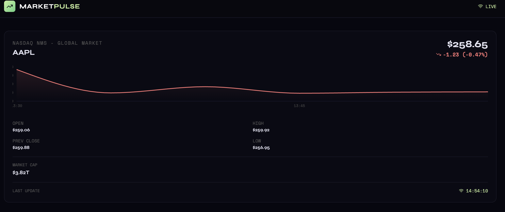

# 📈 MarketPulse — Real-Time Stock Dashboard

A full-stack real-time stock dashboard built with **Python + FastAPI** (backend) and **React + TypeScript** (frontend).

## Screenshot



*Real-time stock data for AAPL displayed in a dark, terminal-style UI with intraday chart, key metrics, and live updates via WebSocket.*

---

## Project structure

```
stock-dashboard/
├── backend/                 # Python API service
│   ├── main.py              # FastAPI application
│   ├── requirements.txt     # pip dependencies
│   ├── Dockerfile           # build instructions for container
│   └── .dockerignore
├── frontend/                # React UI
│   ├── src/                 # source code
│   ├── package.json
│   ├── vite.config.ts
│   ├── Dockerfile           # multi-stage build
│   └── .dockerignore
├── docker-compose.yml       # brings both services up
└── .env                     # environment variables (not checked in)
```

---

## Running the application

There are two supported workflows: **local development** and **containerised deployment**.

### 🛠 Local development (fast feedback)

1. **Backend**
   ```bash
   cd backend
   python -m venv venv
   source venv/bin/activate    # (or use your preferred env manager)
   pip install -r requirements.txt
   uvicorn main:app --reload --port 8000
   ```
   > API: `http://localhost:8000`  
   REST: `GET /stock/{ticker}`  
   WS: `ws://localhost:8000/ws/{ticker}`

2. **Frontend**
   ```bash
   cd frontend
   npm install            # or yarn
   npm run dev
   ```
   > UI: `http://localhost:5173`  (configured proxy will reach the backend)

This workflow lets you iterate on Python and React simultaneously.

### 🐳 Docker / Compose (production‑like)

Ensure you have [Docker](https://www.docker.com/) installed.
Place any secrets (e.g. `FINNHUB_API_KEY`) in a `.env` file at the repo root; a sample is shown below.

```env
# .env (do NOT commit this file)
FINNHUB_API_KEY=your_key_here
```

Build both images and start the stack:

```bash
docker-compose build       # caches dependencies and performs frontend build
docker-compose up          # or docker-compose up -d
```

After startup:
- Backend: `http://localhost:8000/` (health check)
- Dashboard UI: `http://localhost/` (port 80)
- To tear down: `docker-compose down`

> The Compose configuration reads `${FINNHUB_API_KEY}` from the `.env` file and injects it into the backend container.

---

## Features

- **Real-time streaming** via WebSocket (updates every 10 seconds)
- **Intraday price chart** with area fill and reference line at previous close
- **Key statistics**: open, previous close, day high/low, market cap
- **Live connection status** indicator with timestamp of last update
- **Dark, terminal-style UI** using Space Mono + Syne fonts
- Single-stock view (configure via `DISPLAY_TICKERS` in [frontend/src/App.tsx](frontend/src/App.tsx))

---

## Supported tickers

The dashboard currently displays **AAPL** (configurable). Works with any ticker supported by Finnhub:
* US stocks: `AAPL`, `MSFT`, `GOOGL`, `NVDA`, `TSLA`, `AMZN`, etc.
* ETFs: `SPY`, `QQQ`, `VTI`, `IVV`
* International: `ASML`, `TSM`, `BABA`

To display different stocks, edit `DISPLAY_TICKERS` in [frontend/src/App.tsx](frontend/src/App.tsx#L13).

---

## API & Dependencies

The backend uses **Finnhub** for real-time stock data:

| Provider | Free tier | Status |
|---|---|---|
| [Finnhub](https://finnhub.io) | 60 calls/min | ✅ Active — set `FINNHUB_API_KEY` env var |
| [Polygon](https://polygon.io) | 5 calls/min | Alternative option |
| [Alpaca](https://alpaca.markets) | free paper trading | Alternative option |

Dependency versions are locked in `requirements.txt` and `package.json`/`package-lock.json` for reproducibility.